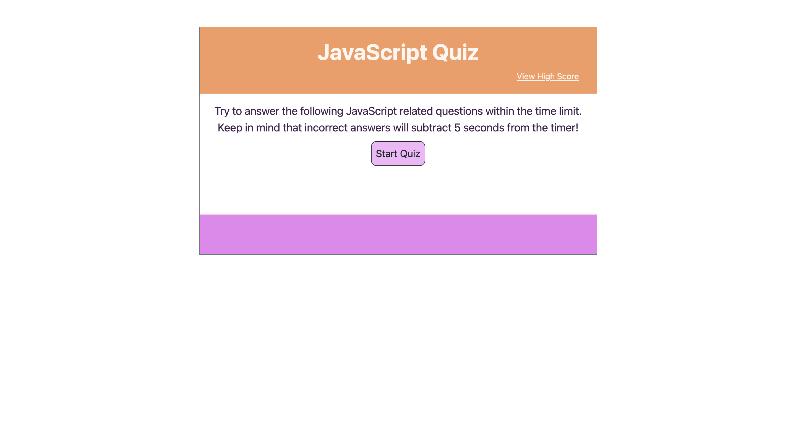
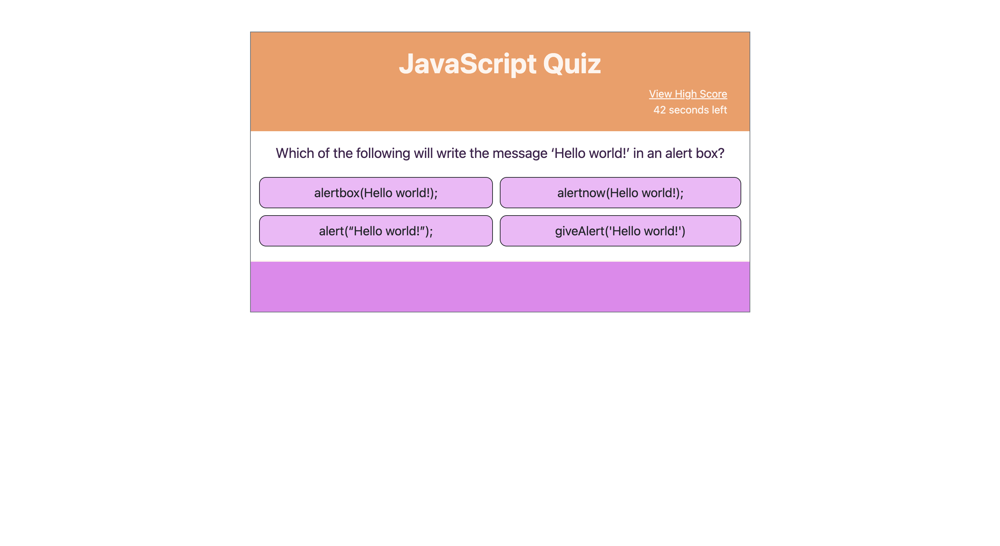
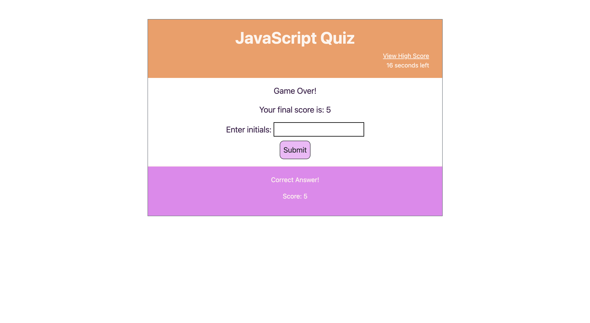
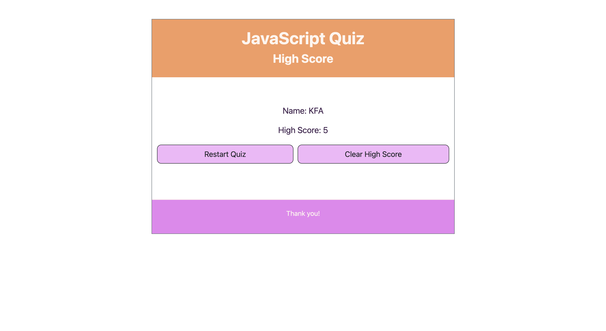

# Module 04 Web APIs: Code Quiz

## User Story

```
AS A coding boot camp student
I WANT to take a timed quiz on JavaScript fundamentals that stores high scores
SO THAT I can gauge my progress compared to my peers
```

## Acceptance Criteria

```
GIVEN I am taking a code quiz
WHEN I click the start button
THEN a timer starts and I am presented with a question
WHEN I answer a question
THEN I am presented with another question
WHEN I answer a question incorrectly
THEN time is subtracted from the clock
WHEN all questions are answered or the timer reaches 0
THEN the game is over
WHEN the game is over
THEN I can save my initials and my score
```

## Description

For this project, it was required to create a coding quiz using JavaScript. The quiz app runs in the browser and works as follows:

Upon loading the page, the user will be shown a screen with rules and a start button.

Upon clicking the start button, the screen will show the first of 5 multiple choice questions and the timer will start counting down from 45 seconds.

For each question, if the user selects the correct answer, their score will increment and 'correct answer!" will display below the quiz. If the incorrect answer is selected, 5 seconds will be be subtracted from the timer and "wrong answer!" will display below the quiz.

Once the timer ends OR all the questions have been answered, the screen will display the "Game Over" message along with the user's score and an input field to enter initials.

Upon entering the initials and clicking submit, the input will be validated and the initials/score pair will be stored in local storage.

The user will then be sent to a High Score page that will display the high score with the initials (this data will be retrieved from local storage). The user will also be presented with two buttons, one to restart the quiz and one to reset the high score and remove it from local storage.

To create this application, I utilized basic HTML and CSS and concentrated mainly on JavaScript. Where possible I generated (or removed) elements and attributes dynamically through JavaScript and made use of multiple functions to run each component of the game.

Below are images of the user interface of the game as displayed to the user:









URL to deployed game:
https://kaitlynatif.github.io/Coding_Quiz/

URL to GitHub repository:
https://github.com/kaitlynatif/Coding_Quiz

For any questions, please contact me at kaitlynatif90@hotmail.com

## License

MIT License

Copyright (c) [2023] [Kaitlyn Atif]

Permission is hereby granted, free of charge, to any person obtaining a copy of this software and associated documentation files (the "Software"), to deal in the Software without restriction, including without limitation the rights to use, copy, modify, merge, publish, distribute, sublicense, and/or sell copies of the Software, and to permit persons to whom the Software is furnished to do so, subject to the following conditions:

The above copyright notice and this permission notice shall be included in all copies or substantial portions of the Software.

THE SOFTWARE IS PROVIDED "AS IS", WITHOUT WARRANTY OF ANY KIND, EXPRESS OR IMPLIED, INCLUDING BUT NOT LIMITED TO THE WARRANTIES OF MERCHANTABILITY, FITNESS FOR A PARTICULAR PURPOSE AND NONINFRINGEMENT. IN NO EVENT SHALL THE AUTHORS OR COPYRIGHT HOLDERS BE LIABLE FOR ANY CLAIM, DAMAGES OR OTHER LIABILITY, WHETHER IN AN ACTION OF CONTRACT, TORT OR OTHERWISE, ARISING FROM, OUT OF OR IN CONNECTION WITH THE SOFTWARE OR THE USE OR OTHER DEALINGS IN THE SOFTWARE.